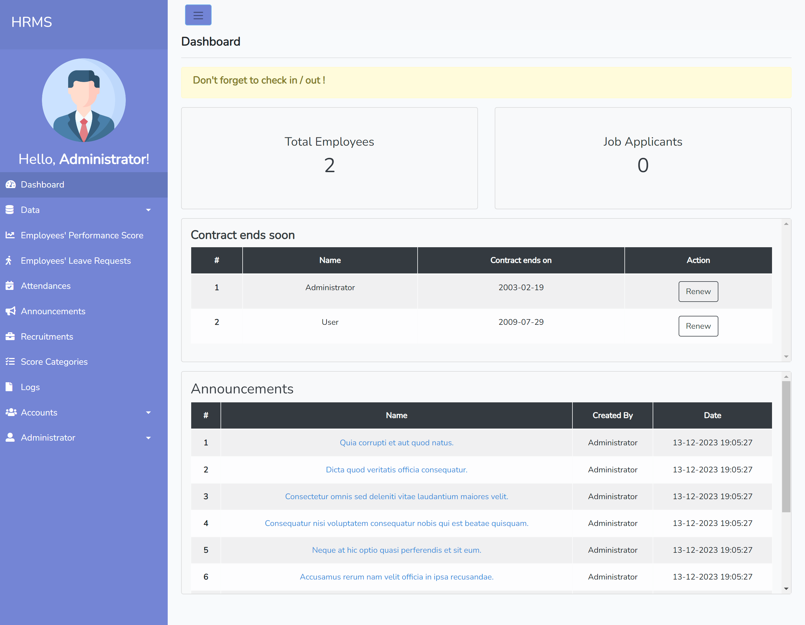
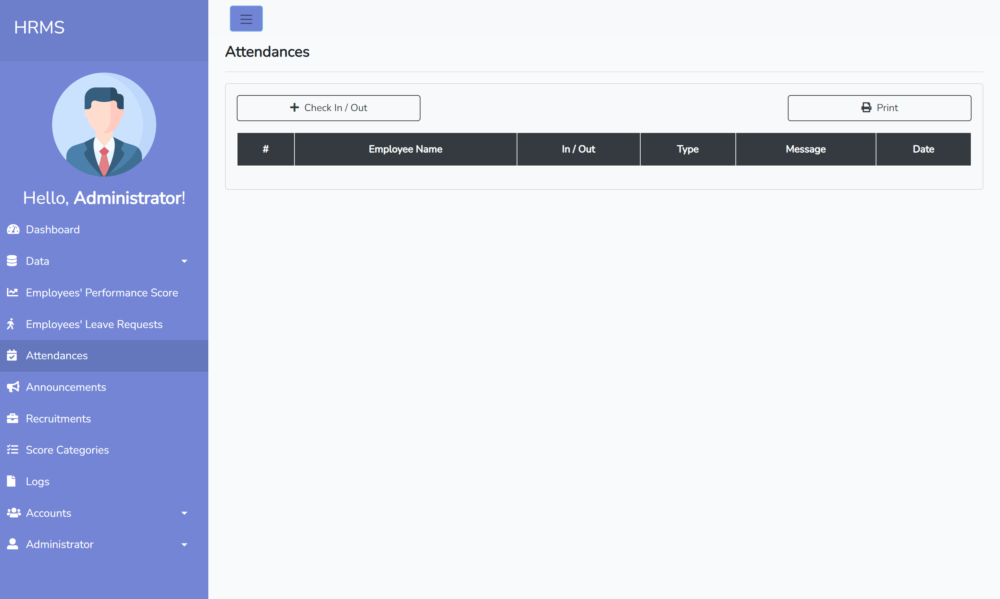
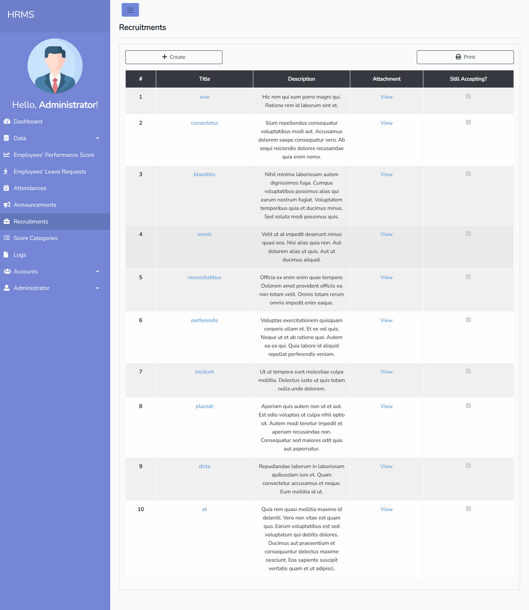

# Human Resource Management System

This is an web application for managing human resources in a company. It was built using Laravel 8.
 
 
The application was a requirement for my college "On the Job Training" studies in a company that I've worked for.

## Steps to run this application:

1. Click on `<> Code` button
2. Copy the HTTPS/SSH repository link
3. Run `git clone` command on your terminal.
4. Install the necessary dependencies by running `composer install`
5. Creating .env file by `cp .env.example .env` and fill in the necessary fields, e.g.: database connection, etc.
6. Generate the application key by running `php artisan key:generate`
7. Next, run the database migration with this `php artisan migrate` command.
8. You can seed the database with `php artisan db:seed` command.
9. Lastly, serve the application with this `php artisan serve` command.
10. The HRMS application should accessible on your browser on "http://localhost:8000"

### Login Credentials

You can log into the application with this credentials (if you did the database seeding).

-   Username: `admin@gmail.com`
-   Password: `admin`

## Screenshots

**Home Screen**

**Dashboard Screen**

**Employee List Screen**

**Employee Leaves Screen**

**Attendances Screen**

**Recruitment Screen**

**Recruitment Detail Screen**

